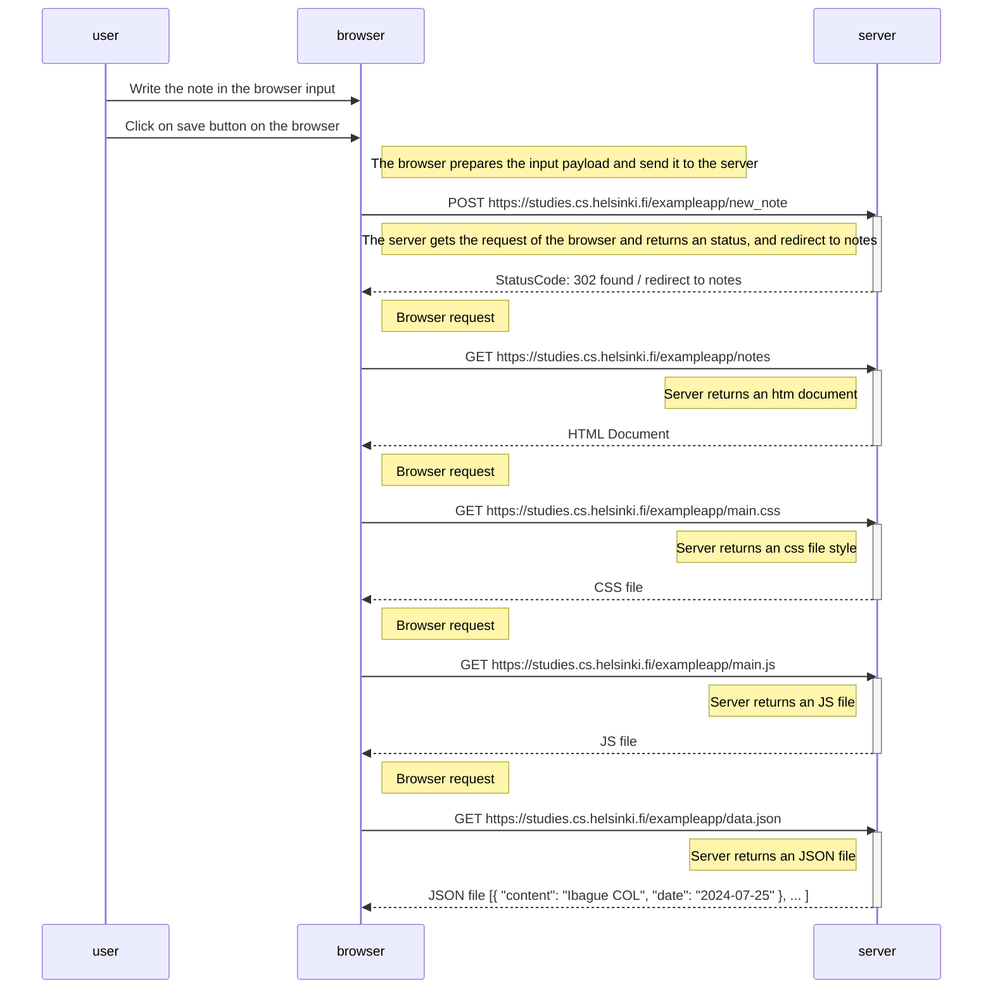

```mermaid
sequenceDiagram
    participant user 
    participant browser
    participant server

    user ->>browser: Write the note in the browser input 
    user ->>browser: Click on save button on the browser 
    Note right of browser: The browser prepares the input payload and send it to the server

    browser->>server: POST https://studies.cs.helsinki.fi/exampleapp/new_note
    activate server
    note left of server: The server gets the request of the browser and returns an status, and redirect to notes
    server-->>browser: StatusCode: 302 found / redirect to notes
    deactivate server

    note right of browser: Browser request
    browser->>server: GET https://studies.cs.helsinki.fi/exampleapp/notes
    activate server
    note left of server:Server returns an htm document
    server-->>browser: HTML Document
    deactivate server 

    note right of browser: Browser request
    browser->>server: GET https://studies.cs.helsinki.fi/exampleapp/main.css
    activate server
    note left of server:Server returns an css file style
    server-->>browser: CSS file
    deactivate server 

    note right of browser: Browser request
    browser->>server: GET https://studies.cs.helsinki.fi/exampleapp/main.js
    activate server
    note left of server:Server returns an JS file 
    server-->>browser: JS file 
    deactivate server 

    note right of browser: Browser request
    browser->>server: GET https://studies.cs.helsinki.fi/exampleapp/data.json
    activate server
    note left of server:Server returns an JSON file 
    server-->>browser: JSON file [{ "content": "Ibague COL", "date": "2024-07-25" }, ... ]
    deactivate server 

```