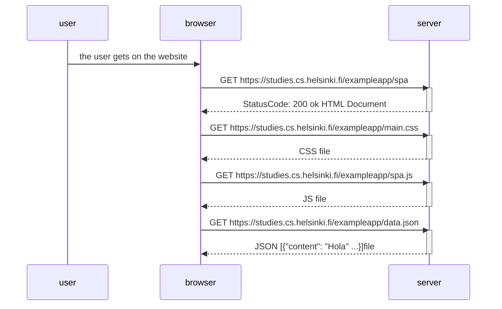

```mermaid
sequenceDiagram
    participant user 
    participant browser
    participant server

    user ->>browser: the user gets on the website 
    
    browser->>server: GET https://studies.cs.helsinki.fi/exampleapp/spa
    activate server
    server-->>browser: StatusCode: 200 ok HTML Document
    deactivate server

    browser->>server: GET https://studies.cs.helsinki.fi/exampleapp/main.css
    activate server
    server-->>browser: CSS file
    deactivate server 

    browser->>server: GET https://studies.cs.helsinki.fi/exampleapp/spa.js
    activate server
    server-->>browser: JS file
    deactivate server 

    browser->>server: GET https://studies.cs.helsinki.fi/exampleapp/data.json
    activate server
    server-->>browser: JSON [{"content": "Hola" ...}]file 
    deactivate server 
```